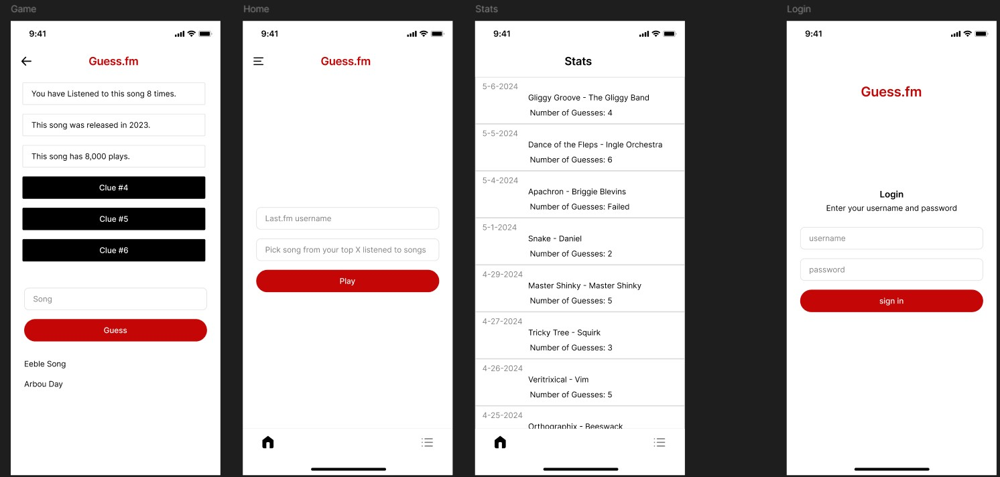
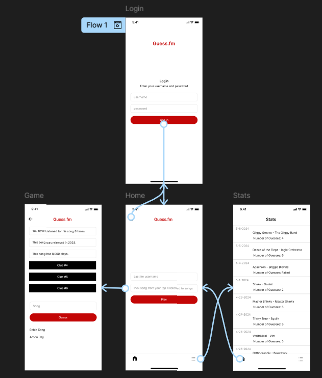
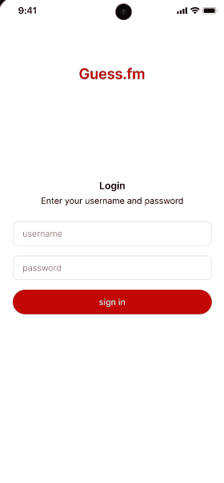
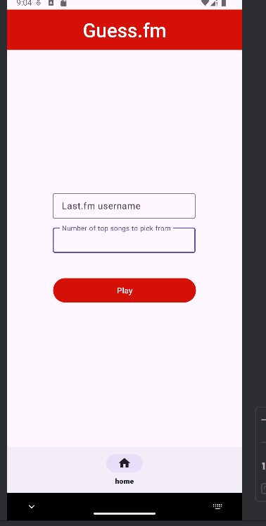
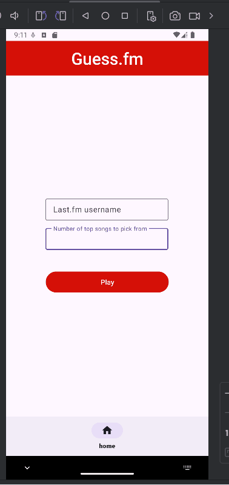

### Description

A daily guessing game, like wordle. The user inputs their last.fm account name and then the app picks a random song from their top listened to songs for the user to try to guess.  Each time the user guesses incorrectly, a new clue will be revealed. The clues will be ordered as follows.

## Wireframe

 

### An example where the user sets the song to be picked from their top 5 songs and fail to guess the song.

### An example where the user sets the song to be picked from their top 80 songs and succeed in guessing the song.

## App Demo Video

[![Demo Video]](https://youtu.be/awT99LD5744)

