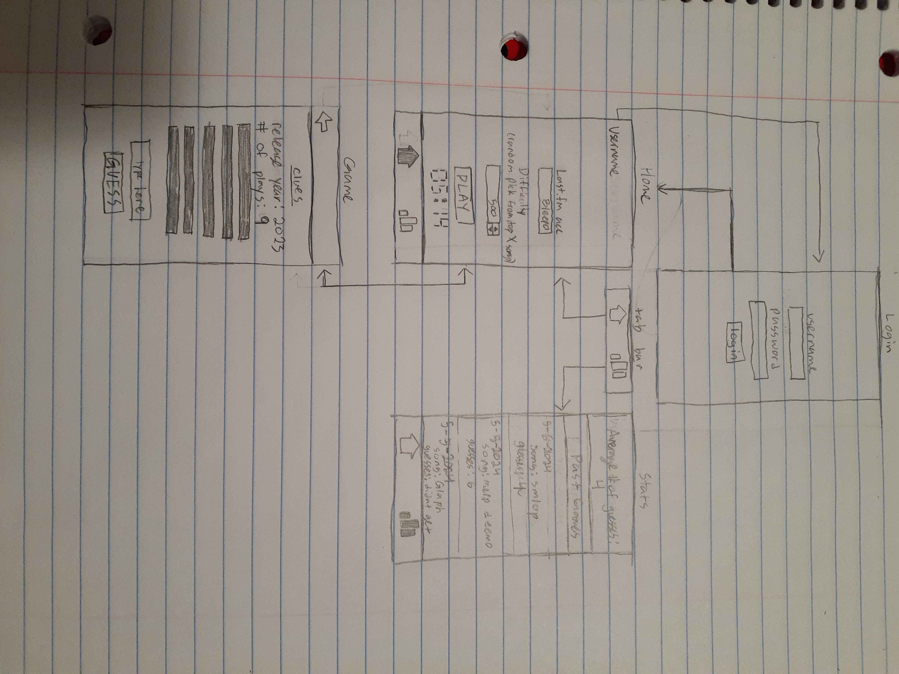
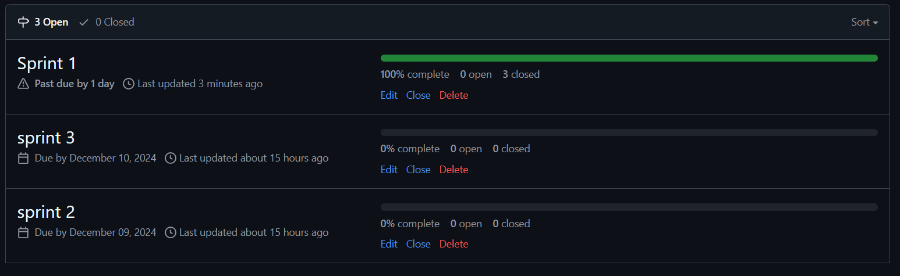
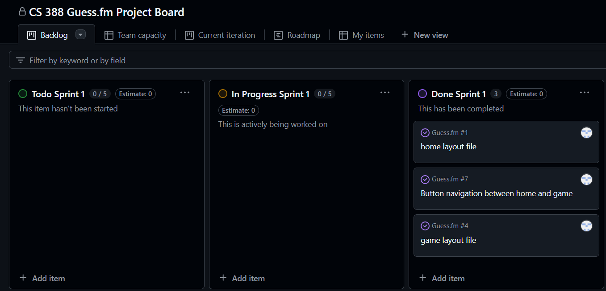
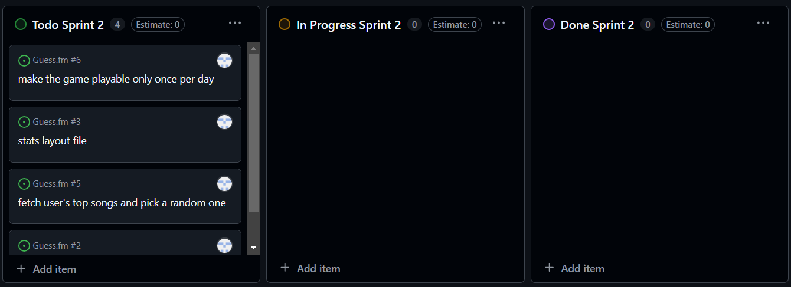
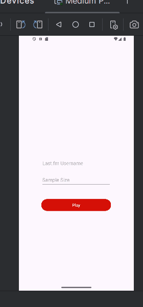
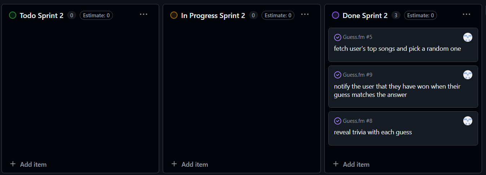
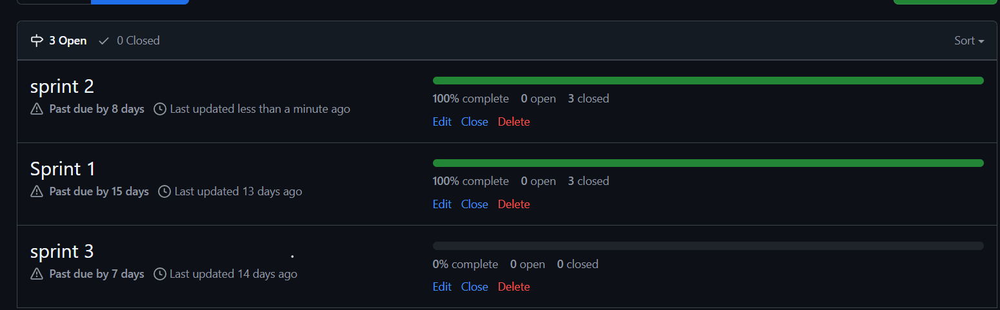

# Milestone 1 - Guess.fm (Unit 7)

## Table of Contents

1. [Overview](#Overview)
1. [Product Spec](#Product-Spec)
1. [Wireframes](#Wireframes)

## Overview

### Description

A daily guessing game, like wordle. The user inputs their last.fm account name and then the app picks a random song from their top listened to songs for the user to try to guess.  Each time the user guesses incorrectly, a new clue will be revealed. The clues will be ordered as follows.
1. release date and user scrobbles
2. overall scrobbles
3. tags
4. letter it starts with
5. duration
6. similar track
7. artist
8. album cover
9. first two letters
### App Evaluation

[Evaluation of your app across the following attributes]
- **Category:** Entertainment
- **Mobile:** How uniquely mobile is the product experience?
    - What makes your app more than a glorified website?
    - Try for 2 or more of these: maps, camera, location, audio, sensors, push, real-time, etc
	    - the app will use the device time to determine when it is available to do a new game
	    - the app could use notifications to let the user know that a new game is available
- **Story:** How compelling is the story around this app once completed?
    - The value comes in the personalization of the game using the users last.fm account
    - I have posed the idea to my friends and they all see the value in it.
- **Market:** How large or unique is the market for this app?
    - The userbase is strictly last.fm users so not too large.
    - I believe this app does provide a unique value to a niche group
    - Last.fm users who play daily wordle type games.
- **Habit:** How habit-forming or addictive is this app?
    - The average user would open the app around once a day.
    - The average user only consumes the app.
- **Scope:** How well-formed is the scope for this app?
    - It shouldn't be too technically challenging. The last.fm api does most of the work.
    - If I have time I have time I want to implement a hangman system for the app so its not just the api clues but i think just the clues will still be a fun game.
    - I think its very well defined. The app randomly picks a song from the user's last.fm account's top listened to songs, and then they keep guessing and getting new clues until they get it or run out of guesses.

## Product Spec

### 1. User Features (Required and Optional)

**Required Features**

1. user can input their last.fm account (not login)
2. user can input a guess for a song and receive feedback in the form of clues
3. user can only play once per day
4. user can navigate from home screen to game screen

**Optional Features**

1. user can receive a notification when a new song is available to guess
2. user can choose to guess a song or a letter and receive feedback on where that letter is present in the song title (hangman)
3. user can customize the difficulty (pick random song from top X listened to songs)
4. user can log in
5. user can view past completed games and the number of guesses it took them
6. user can see statistics (average # of guesses, artist they are most familiar with, etc.)
7. user can copy the results of the game to clipboard
8. inputted guesses are cleaned and guesses that are similar enough count as correct

### 2. Screen Archetypes

- Login
	- User can log in
- Home
	- User can see the username they used to login
	- User can input Last.fm account username to use for game personalization
	- User can configure difficulty
	- If the user has already played the game they see the results and a timer until a new song is available
- Game
	- User can play the game
	- If the user has already played the game they see the results and a timer until a new song is available
- Stats
	- User can scroll through past games and their results
	- User can see statistics on their past performance

### 3. Navigation

**Tab Navigation** (Tab to Screen)

* Home
* Stats

**Flow Navigation** (Screen to Screen)

- Login
	- => Home
  - Home
	  - => Game
	  - => Login
  - Game
	  - => Home

## Wireframes

[Add picture of your hand sketched wireframes in this section] 

 

 

### [BONUS] Digital Wireframes & Mockups

### [BONUS] Interactive Prototype

 

# Milestone 2 - Build Sprint 1 (Unit 8)

## GitHub Project board

## Issue cards

## Issues worked on this sprint

- home layout file
- game layout file
- button navigation between home and game

 

# Milestone 3 - Build Sprint 2 (Unit 9)

## GitHub Project board

## Completed user stories

- List the completed user stories from this unit
- List any pending user stories / any user stories you decided to cut
from the original requirements

### completed
- user can input their last.fm account (not login)
- user can input a guess for a song and receive feedback in the form of clues
- user can navigate from home screen to game screen
- user can customize the difficulty (pick random song from top X listened to songs)
- inputted guesses are cleaned and guesses that are similar enough count as correct
### cut
- user can choose to guess a song or a letter and receive feedback on where that letter is present in the song title (hangman)
- user can receive a notification when a new song is available to guess
- user can only play once per day
- user can log in
- user can view past completed games and the number of guesses it took them
- user can see statistics (average # of guesses, artist they are most familiar with, etc.)
- user can copy the results of the game to clipboard

### An example where I set the song to be picked from the user's top 5 songs and fail to guess the song.

### An example where I set the song to be picked from the user's top 80 songs and succeed in guessing the song.

## App Demo Video

[![Demo Video]](https://youtu.be/awT99LD5744)

## Demo Day Full Demo Video

[![Full Demo Video]](https://youtu.be/Y7ARmzRValw)

